# STS(Smart Tag Service)

### | NFC 태그를 이용한 테이블 오더 서비스

## 📆 프로젝트 기간

2024.08.28 ~ 2024.10.01 (5주)

## 🛠️ 기술 스택

### 공통

### Front-End

### Back-End

## 📋 설계 산출물 및 관련 문서

### 시스템 아키텍쳐

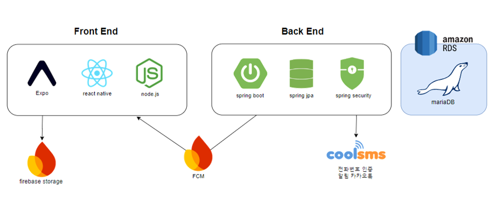

### 플로우 차트
사용자 기능
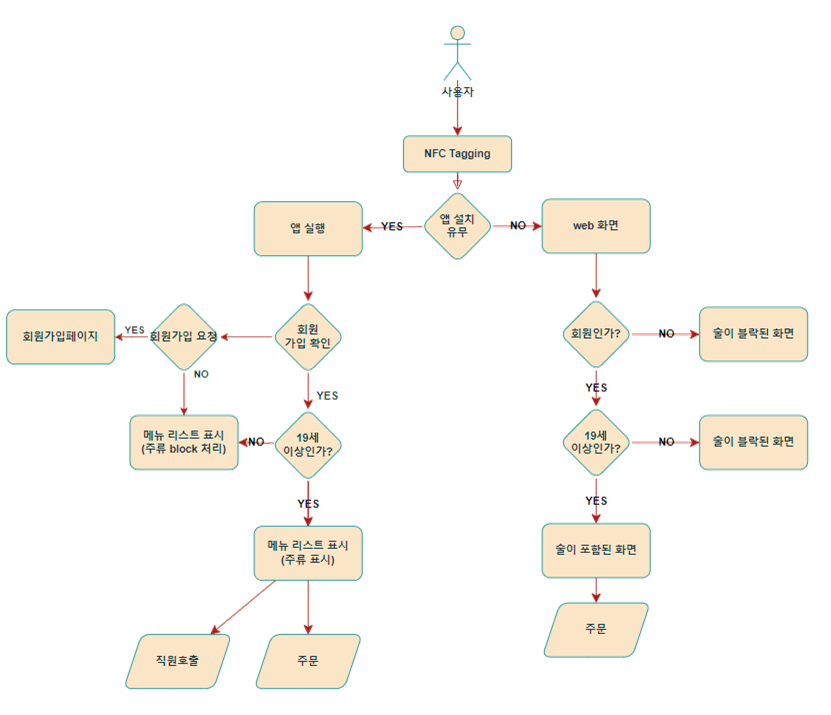
결제 방식

판매자기능

### 요구사항 정의

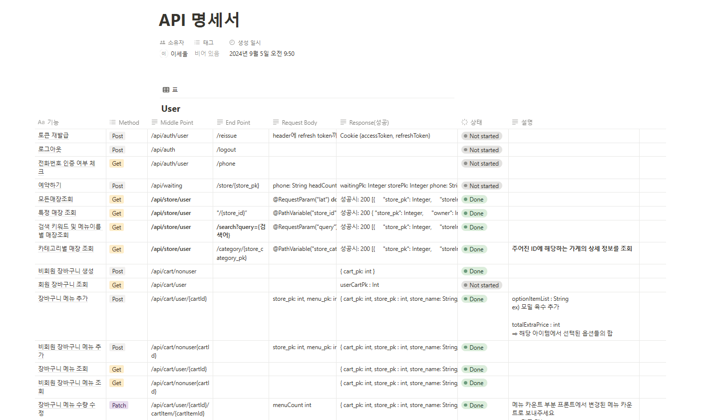

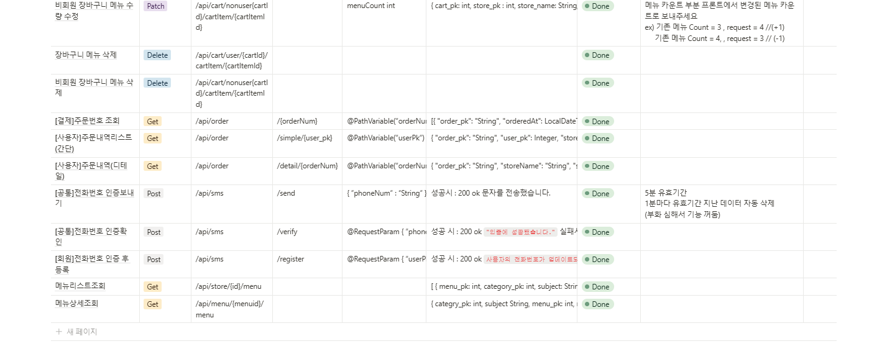

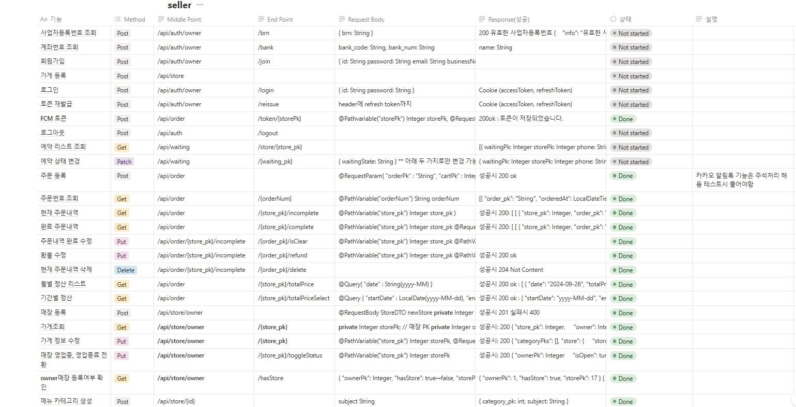

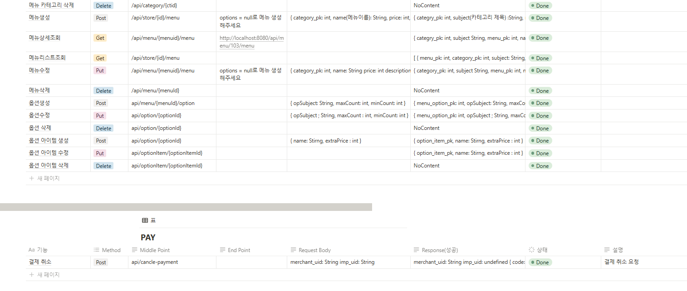

### 화면 설계서

#### - 사용자 로그인 페이지

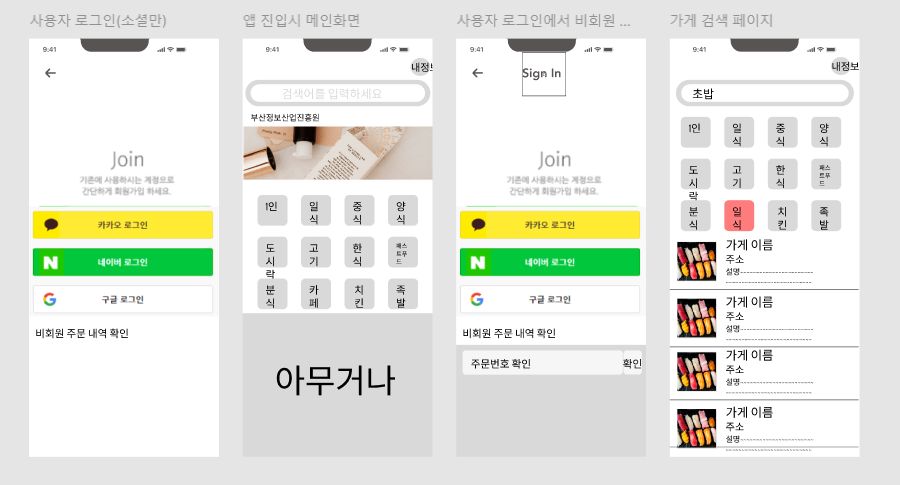

#### - 사용자 메인 페이지

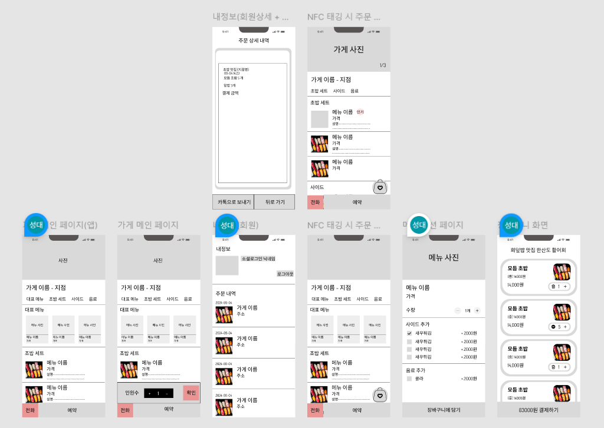

#### - 결제 페이지

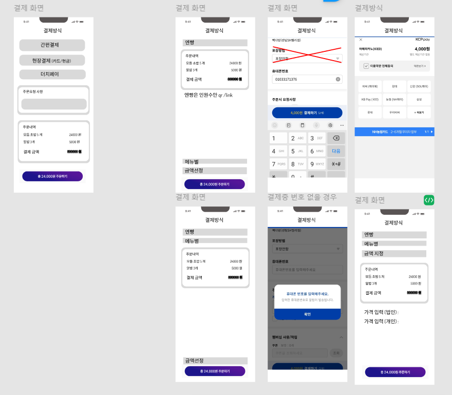

#### - 판매자 페이지

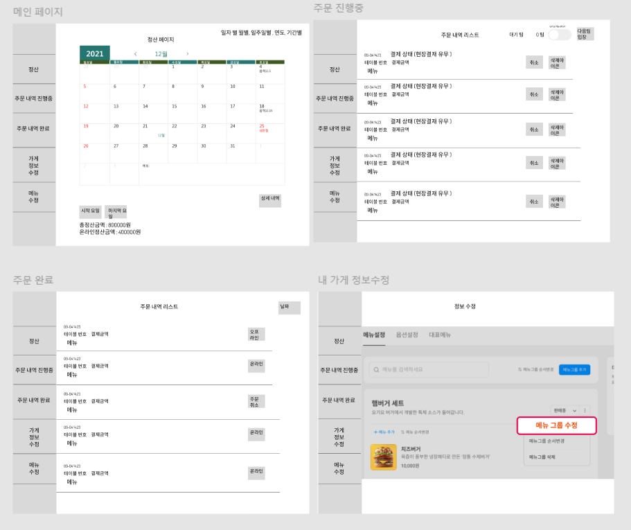

### ER Diagram

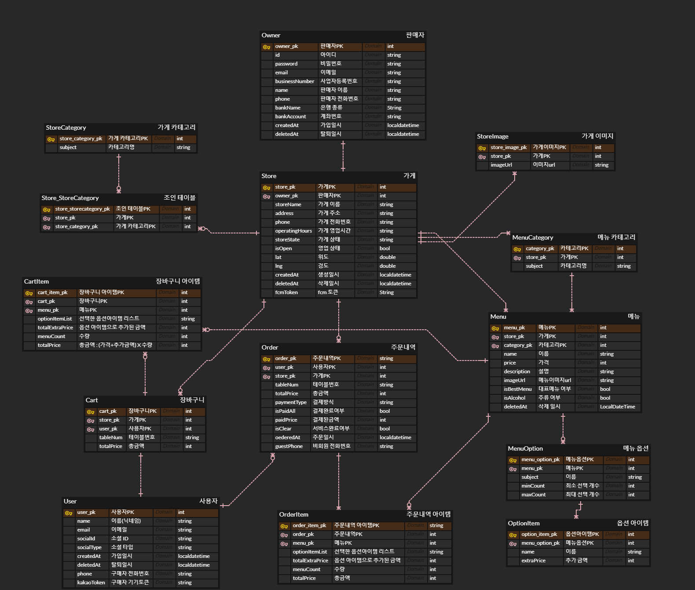

### 프로젝트 관련 문서

## 👪 팀원 소개

| [오재경](https://github.com/dodal0415)                                  | [노하영](https://github.com/nohhayeong) | [이지현](https://github.com/jjhh1234) | [주효빈](https://github.com/hyobin0704)                   | [양성대](https://github.com/codingnewwbie)| [이세울](https://github.com/sl39)                                  | [이정우](https://github.com/Gom534)             |
| ------------------------------------ | ------------------------------ | ----------------------------- | -------------------------------- | ------------------------------- | ------------------------------------ | --------------------- |
| 총괄 팀장, 벡엔드, 판매자 메인 및 주문, 카카오/문자 및 FCM 알림, 휴대폰 인증 서비스 | 백엔드 팀장, 자체/소셜 로그인, 예약 서비스  | 백엔드, 메뉴 및 장바구니 서비스 | 백엔드, 매장 정보 서비스 | 프론트 팀장,UI/UX, 메인 페이지, 메뉴 및 장바구니 페이지 | 프론트,UI/UX, 판매자 페이지, 휴대폰 인증 서비스 | 프론트,UI/UX, 결제 서비스, 웹 소켓 |
